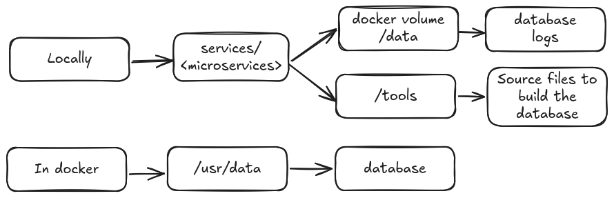

# Databases

There's is a total of 5 databases across the project which are the following :
| Container  | Name of DB |
| ------------- |:-------------:|
| Accessibility | languages.db |
| Users | users.db |
| Account | account.db |
| Friends | friends.db |
| Dashboard | stats.db |

Each database and linked logs has it's own isolated volume and is stored in the data/ directory of each sources files's container locally and in /usr/data inside of each container.
The sources files for database building are in /tools of each container's source directory. That where you will find the tables definition and tests but they will also be presented and explained here for better  readability.



The correct methods for avoiding SQL injections is to NOT USE variable export for the query.
Bad SQL query (dangerous) :
```
	const word;
	const langCode;

	const query = `
		SELECT translation FROM translations WHERE {$word} = ? AND {$language_code} = ?
	`;
	
	const result = await serv.dbLanguage.get(query);
```

Instead a good practice is to set variables in the query direcly when sending the query, not when building it.
It will look like this :
```
	const word;
	const langCode;

	const query = `
		SELECT translation FROM translations WHERE word = ? AND language_code = ?
	`;

	const result = await serv.dbLanguage.get(query, [word, langCode]);
```

## Accessibility

### General overview

The accessibily container holds the translation for each supported langangues (English, French and Spanish). 
There is only one table in this database : translations

The table has 4 column :
* ID &rarr; integer (__primary key__)
* word &rarr; text
* language_code &rarr; text 
* translation &rarr; text

The word column is meant to hold the key or phrase identifier. The language_code column holds the language code (dah), like "en" or "fr". And lastly the translation will hold the translation of the word in it's targeted language code.
So for example we could have :
* word == "hello"
* language_code == "fr"
* translation == "bonjour"

A SQL query to find the translation of a word would look like this :
```
SELECT translation FROM translations WHERE word = 'hello' AND language_code = 'fr';

-- will return "bonjour"
```

The combination betweent the word column and the language_code column is a __natural key__. It's basically an identifier that is formed by the combination of existing data in the table. It has meaning and therefore might be subject of changes in the future.

We have the first column (ID) which I havn't mention yet. The column is there for multiple reasons. First, it is good pratice in SQL to keep an unmutable ID for each row of a table. It's known as a __surrogate key__, which only purpose is to uniquely identify a row in a database. It has absolutely zero meaning data wise. We use this surrogate key because the natural key can change. So having a stable, meaningless ID ensure we can always reliably reference a row in the table, which is mandatory for stability.
It can also be used for easy modification. Since the natural key is a combination of other data in the table, it can be easier to make a SQL query looking for an integer than combination of two texts.
Lasty, even is the table will remain pretty small, being able to make shorter, simpler queries also improves perfomances. It can make sense to simplify queries where we can when we have several databases, to maximise of perfomances for much more daunting tasks.

### Usage and associated functions

TODO :
* ~~get translation of a word by word and language code~~

This databases won't have a function to update the data via the code. 
To add translation I think the best course of action will be to directly modify the seed.sql which adds data to the database at launch.

## Users

### General overview

The users container holds the data for a user's profile such as the bio, profile picture, online status and so forth.
The goal here is not to hold account info (like password), those informations will be handle in the account microservice.

The tables in this database are pretty straight forward. I will elaborate on a couple column that need explanation in my opinion

We have two tables here :
* userProfile
* userStat

#### userProfile

This table has the following column :
* userID &rarr; integer (__primary key__)
* username &rarr; text
* avatar &rarr; text
* bio &rarr; text
* profileColor &rarr; text
* activityStatus &rarr; integer 
* lastConnexion &rarr; datetime

userID will match between different table and database and if a general ID for a user.

activityStatus will be used to keep track of whether the user if offline, online or playing. The following value and meaning will be :

| Value  | Meaning |
| ------ |:-------:|
|   0    | offline |
|   1    | online  |
|   2    | playing |

#### userStats

This table has the following column :
* userID &rarr; integer (__primary key__)
* longestMatch &rarr; integer
* shorestMatch &rarr; integer
* totalMatch &rarr; integer
* totalWins &rarr; integer
* winStreak &rarr; integer
* averageMatchDuration &rarr; integer
* highestScore &rarr; integer

We don't have totalLosses because it can easily be computed by totalMatch and totalWin so we remove so useless SQL queries by not storing totalLosses.

averageMatchDuration will be in seconds.

### Usage and associated functions

TODO :
* add curl examplus of function usages
* userStats
    * ~~get user stats by userID~~
        
        ```curl http://localhost:2626/users/userStats/<userID>```
    * ~~update all game stats~~
    * ~~update longest match~~
    * ~~update shorest match~~
    * ~~update total match~~
    * ~~update total wins~~
    * ~~update win streak~~ 
    * ~~update average match duration~~
    * ~~update highest score~~

* userProfile
    * ~~get activity status by userID~~
        
        ``` curl http://localhost:2626/users/activity/<userID> ```
    * ~~get profile info (username. avatar, bio, profile color, lastConnexion) by userID~~
        
        ``` curl http://localhost:2626/internal/users/profile/<userID> ```
    * ~~get lastConnexion by userID~~
        
        ```curl http://localhost:2626/users/lastConnection/<userID> ```
    * ~~update avatar~~
            
            curl -X POST \
            -H "Content-Type: application/json" \
            -d '{"newAvatar": "<new avatar>"}' \
            http://localhost:2626/users/updateAvatar/<userID>
    * updata bio
        
        ```
        curl -X POST \
        -H "Content-Type: application/json" \
        -d '{"newBio": "<bio>>"}' \
        http://localhost:2626/users/updateBio/<userID>
    * update profileColor

        ```
        curl -X POST \  -H "Content-Type: application/json" \
        -d '{"newProfileC": "<new color>"}' \    
        http://localhost:2626/users/updateProfileColor/<userID> 
    * update activity status

        ```
        //newStatus must be a number, between quotes works too :
        curl -X POST \
        -H "Content-Type: application/json" \
        -d '{"newStatus": "<newStatus>"}' \
        http://localhost:2626/users/updateActivityStatus/<userID>
        
        curl -X POST \
        -H "Content-Type: application/json" \
        -d '{"newStatus": <newStatus>}' \  
        http://localhost:2626/users/updateActivityStatus/<userID>
    * update lastConnexion
        
        ```
        curl -X POST \  -H "Content-Type: application/json" \
        -d '{"newConnection": "<DATETIME format YYYY-MM-DD HH:MM:SS>"}' \
        http://localhost:2626/users/updateLastConnection/<userID>
    * update username
        
        ```
        curl -X POST \  -H "Content-Type: application/json" \
        -d '{"newUsername": "<username>"}' \
        http://localhost:2626/users/updateUsername/<userID>
## Account

### General overview

The table has the following column : 
* userID &rarr; integer (__primary key__)
* hashedPassword &rarr; text
* username &rarr; text (__unique__)
* email &rarr; text (__unique__)
* userStatus &rarr; integer
* registerDate &rarr; datetime

The userStatus column stored the role of the user (admin, user). I don't know yet if it will be needed yet.

### Usage and associated functions

TODO :
* register a user
* verify password match for connection to the account
* update password
* verify email for connection
* update username (if we want to allow it)
* get userStatus (if we implement admin features)

## Friends

### General overview

This database has only one table. The table has the following column :
* friendshipID &rarr; integer (__primary key__)
* userID &rarr; integer
* friendID &rarr; integer
* startTimeFriendship &rarr; datetime
* statusFrienship &rarr; boolean

In the same way as the language database, we have the friendshipID as a surrogate key.
The actual way to determine the uniqueness of the friendship is the combination of the userID and the friendID.
The userID references the user who initated the friend request, and the friendID is the user on the receiving hand of the friendship request.

For the statusFriendship :

| Value  | Meaning  |
| ------ |:--------:|
| 0      | pending  |
| 1      | accepted |

### Usage and associated functions

* ~~Add a pending friendship request~~
* ~~Change the statusFriendship to accepted~~
* ~~Remove a frienship~~
* ~~Check if the friendship exists~~
* ~~Get all friends of a user~~
* ~~Get all pending friendship~~

TODO : write script of tests for everything that could go wrong

## Dashboard

### General overview

#### gameMatchInfo

This database has the following tables which has the following column :

* gameID &rarr; integer (__primary key__)
* duration &rarr; integer
* startTime &rarr; datetime
* gameStatus &rarr; integer
* winnerID &rarr; integer 
* loserID &rarr; integer
* tournamentID &rarr; integer
* localGame &rarr; boolean
* scoreWinner &rarr; integer
* scoreLoser &rarr; integer

The gameStatus column might not make the final cut, depending on when we plan on updating the database (throughout the game or only at the end). If we do keep it, the values will have the following meaning :

| Value  |      Meaning     |
| ------ |:----------------:|
|   0    | still in "lobby" |
|   1    |      started     |
|   2    |      ended       |

The tournamentID will allow use the get all the games played in a tournament without having to duplicate data in the tournament table. It can be nulled if a game is not part of a tournament.

localGame's value and meaning are : 

| Value  | Meaning |
| ------ |:-------:|
|   0    | remote  |
|   1    | local   |

There is the question of the local game. If a game is local, the "invited" user is not register as a user, which means not userID. How do we planned on going about it ? We might set the loser/winnerID to null and set a "Invited player" a the game dashboard front wise. TODO : figure that out 

#### tournamentInfo

* tournamentID &rarr; integer (__primary key__)
* winnerID &rarr; integer
* playerIDs &rarr; TEXT

The playersIDs is currently thought of has a JSON array storing the userID of all tournament players. This data format allows for different tournament size and is pretty flexible in the event we implement other tournament size. TODO : Figure out if the JSON array format isn't to complicated and fast enough, and find a replacement if it's not optimized

### Usage and associated functions

#### gameMatchInfo

* created a game and return gameID
* update a game with gameID
* get all tournament's game with tournament ID
* get all game info with gameID
* depending on how the front is, get only some of the info for game dashboard preview ?
* get gameID (and/or gameInfo) with user ID (what game did a user played in)  

#### tournamentInfo

* create a tournament and return tournamentID
* update tournament with tournamentID
* get tournament info with tournmentID
* get tournamentID with userID (what tournament did a user played in)

## Miscellaneous

### Information

The UPDATE method can allow use the perfom addition to a column of a row without having to pull the data from the table first. Like so 

```
UPDATE userStats 
SET totalPlayedGame = totalPlayedGame + 1 
WHERE userID = 101;
```
TODO :
* ~~Change the way the database in instancieted in the code (connect db to fastify like in accessibility container)~~
* secure extern API calls and understand what it actually means
* For larger GET API calls, should make a get function per column or can a function that gets all the needed informations will be better ? Maybe even both ?
* ~~Clean code in friends container's routes.ts file~~ 
* Plug languageDB route to front to see if translation works
* Check function for database query for friend service 404 reply
* check all reply to add success of the request