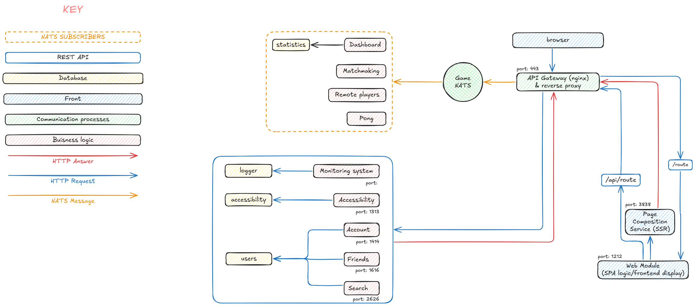

# List of microservices

## User facing microservices

Each microservice has its own DB
Cybersec is handled into each container

- Account management
  - Account creation and deletion
  - Login/logout
  - Edit information

- Friend management
- Search bar
- Matchmaking
- Gameplay

- Dashboard
  - Leaderboard
  - User game stats

- Accessibility microservices
  - Language
  - Visually impaired thingies

## Infrastructure

- nginx
- Cybersec
- Remote players (?)
- SSR

## Logger

- Monitoring system

## Visualisation

## Ports

- ./services/nginx: 443
- ./services/frontend: 1212
- ./services/accessibility: 1313
- ./services/account: 1414
- ./services/dashboards: 1515
- ./services/friends: 1616
- ./services/matchmaking: 1818
- ./services/monitoring: 1919
- ./services/pong: 2020
- ./services/users: 2626
- ./services/ssr: 3838
- ./services/auth : 3939
