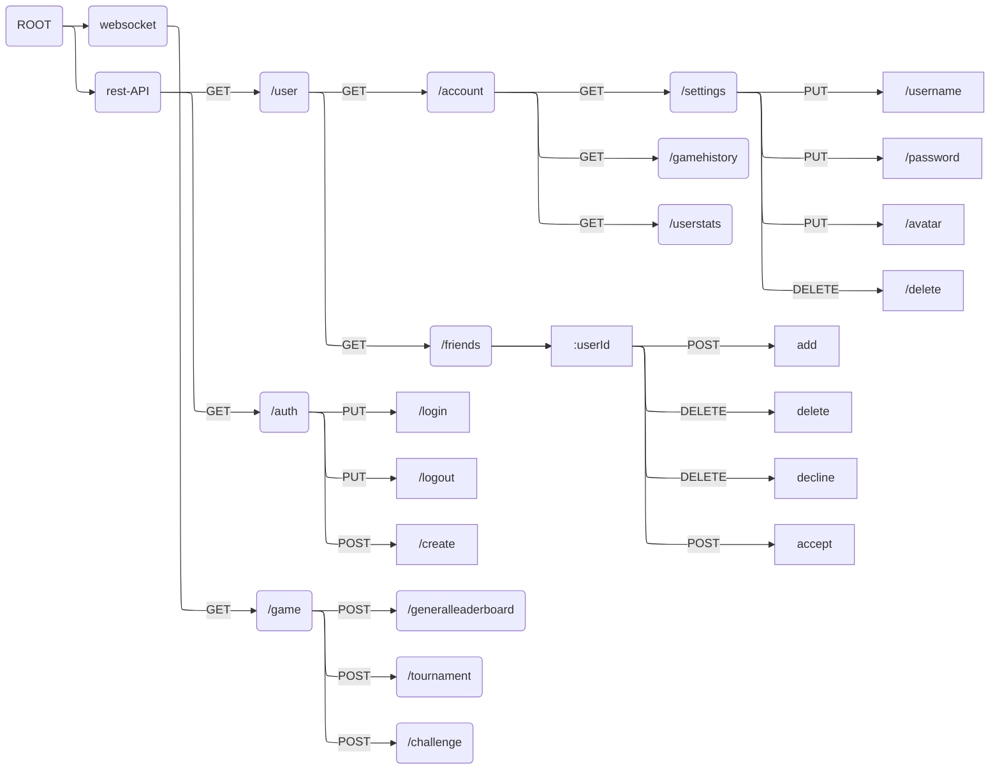

# API endpoint map

```mermaid
---
config:
  layout: elk
  elk:
    mergeEdges: true
    nodePlacementStrategy: BRANDES_KOEPF
---
graph LR;

root("ROOT")
websocket("websocket")
rest("rest-API")

%% REST 
user("/user")
account("/account")
friends("/friends")
auth("/auth")

root --> websocket
root --> rest

rest -- GET --> auth
auth -- PUT --> /login
auth -- PUT --> /logout
auth -- POST --> /create

settings("/settings")
gamehistory("/gamehistory")
userstats("/userstats")

rest -- GET --> user
user -- GET --> account
user -- GET --> friends
account -- GET --> settings
account -- GET --> gamehistory
account -- GET --> userstats

settings -- PUT --> /username
settings -- PUT --> /password
settings -- PUT --> /avatar
settings -- DELETE --> /delete

friends --> :userId -- POST --> add
friends --> :userId -- DELETE --> delete
friends --> :userId -- DELETE --> decline
friends --> :userId -- POST --> accept

%% websockets
game("/game")
generalleaderboard("/generalleaderboard")

tournament(/tournament)
challenge(/challenge)

websocket -- GET --> game

game -- POST --> tournament
game -- POST --> challenge
game -- POST --> generalleaderboard
```
