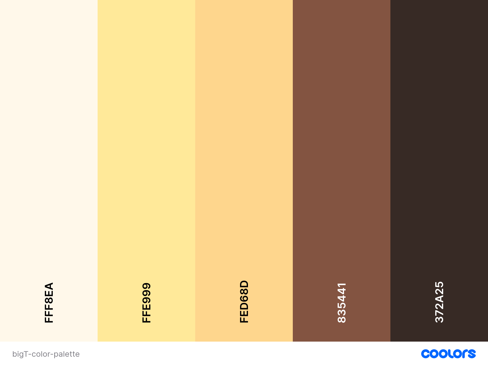
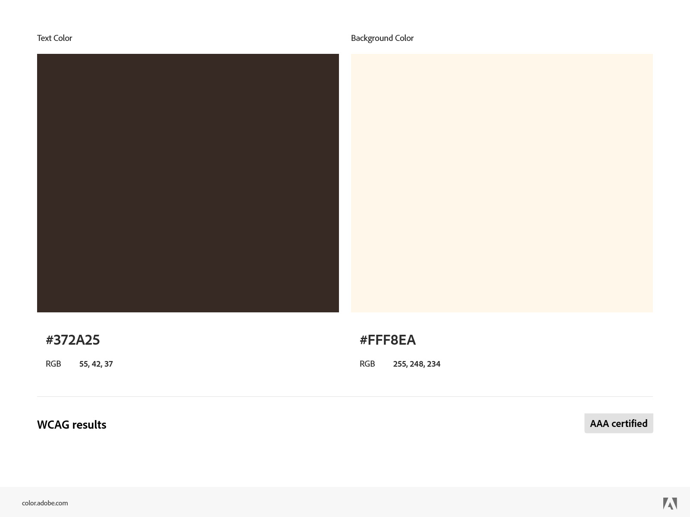
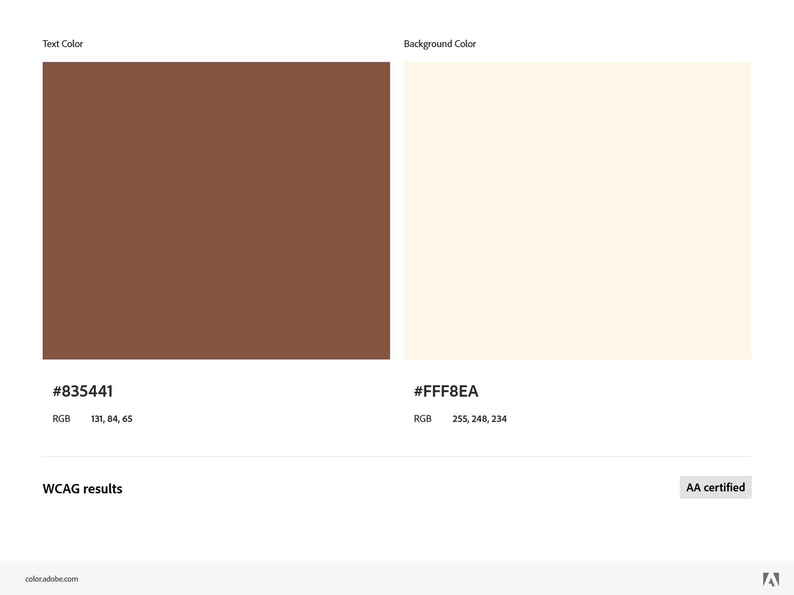
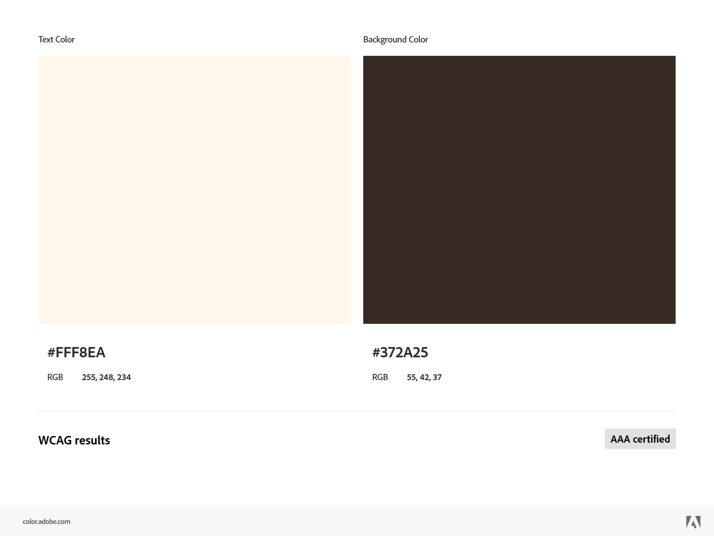
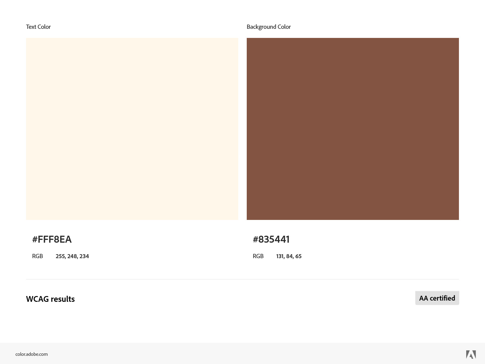
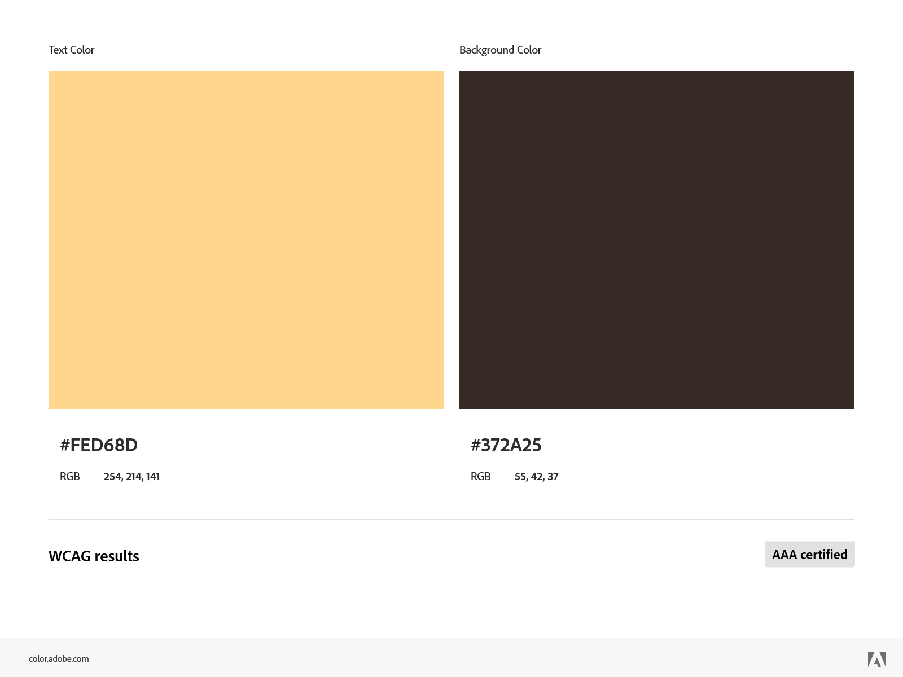

# Color Palette

## Visuals



## Contrasts









## Tailwind CSS syntax

```css
{ 
	'old_lace': 
		{ DEFAULT: '#fff8ea',
		100: '#624100',
		200: '#c48300',
		300: '#ffb727',
		400: '#ffd889',
		500: '#fff8ea',
		600: '#fffaef',
		700: '#fffbf3',
		800: '#fffcf7',
		900: '#fffefb' },
	'jasmine': 
		{ DEFAULT: '#ffe999',
		100: '#524000',
		200: '#a38000',
		300: '#f5c000',
		400: '#ffd747',
		500: '#ffe999',
		600: '#ffedad',
		700: '#fff2c2',
		800: '#fff6d6',
		900: '#fffbeb' },
	'sunset': 
		{ DEFAULT: '#fed68d',
		100: '#4e3301',
		200: '#9c6602',
		300: '#e99802',
		400: '#fdba3d',
		500: '#fed68d',
		600: '#fedea2',
		700: '#fee6b9',
		800: '#ffeed1',
		900: '#fff7e8' },
	'coffee': 
		{ DEFAULT: '#835441',
		100: '#1a110d',
		200: '#34211a',
		300: '#4e3226',
		400: '#684233',
		500: '#835441',
		600: '#ac6e56',
		700: '#c09280',
		800: '#d5b6aa',
		900: '#eadbd5' },
	'van_dyke': 
		{ DEFAULT: '#372a25',
		100: '#0b0807',
		200: '#16110f',
		300: '#211916',
		400: '#2c221d',
		500: '#372a25',
		600: '#695046',
		700: '#9b7768',
		800: '#bca49b',
		900: '#ded2cd' } 
}
```
